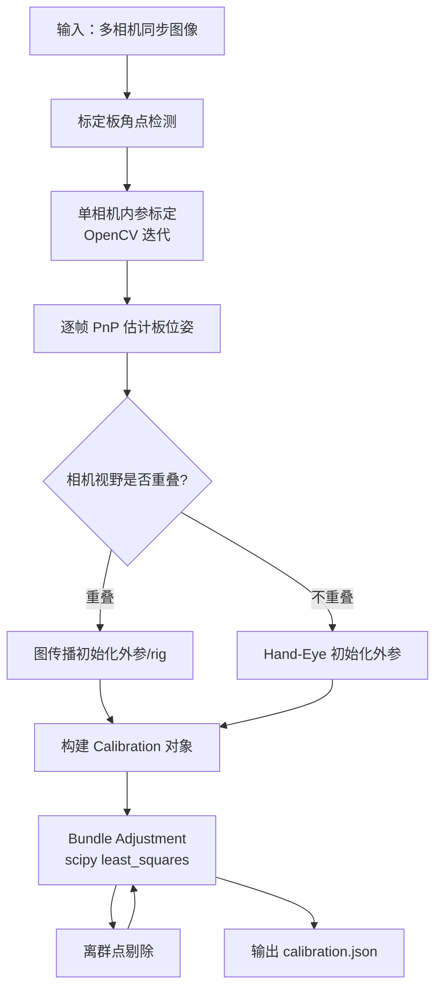

# multical 核心算法与逻辑详解

> 本文档单独展开「核心算法/逻辑」部分，基于 `multical/` 源码。目标是让你**不看代码也能理解数学模型、初始化策略和优化过程**。

---

## 0. 一句话理解

**multical 用标定板角点做观测，先估计各相机内参和每帧的板位姿，再通过图传播初始化多相机外参与 rig 运动，最后用稀疏非线性最小二乘（Bundle Adjustment, BA）联合优化所有参数，使重投影误差最小。**

---

## 1. 问题建模：我们在优化什么？

### 1.1 坐标系与变量

整个系统围绕以下四类未知量展开：

| 符号         | 代码对象                | 含义                                                 |
| ------------ | ----------------------- | ---------------------------------------------------- |
| **K, dist**  | `Camera`                | 每台相机的内参矩阵与畸变系数                         |
| **T_cam**    | `PoseSet` (camera)      | 各相机相对于「参考相机 / rig」的外参（4×4 齐次变换） |
| **T_board**  | `PoseSet` (board)       | 各标定板之间的相对位姿（多板场景）                   |
| **T_rig(t)** | `MotionModel` (motion)  | 每一帧（同步拍摄时刻）rig 在世界中的位姿             |
| **P_board**  | `Board.adjusted_points` | 标定板 3D 角点坐标（可选优化，默认固定）             |

### 1.2 几何关系（核心公式）

对某一帧 `t`、相机 `c`、标定板 `b`、角点 `p`，观测到的 2D 像素点为 `u_obs`，几何链路为：

```
世界点 P_w = T_board[b] · P_board[p]          # 板坐标 → 世界坐标
相机坐标 P_c = inv(T_rig[t]) · inv(T_cam[c]) · P_w   # 世界 → 相机
像素点   u_pred = π(K_c, dist_c, P_c)         # 投影 + 畸变
```

其中 `π` 由 OpenCV 的 `cv2.projectPoints` 实现（`camera.py`）。

**残差（优化目标）**：

\[
r_{c,t,b,p} = u_{\text{obs}} - u_{\text{pred}}
\]

所有有效检测点的残差拼成向量，用 `scipy.optimize.least_squares` 最小化（`optimization/calibration.py` → `bundle_adjust`）。

### 1.3 数据张量结构

检测结果被组织为 4 维 `Table`（`tables.py`）：

```
维度: [camera, frame, board, point]
```

- `point_table`：检测到的 2D 角点
- `pose_table`：每 (camera, frame, board) 的 PnP 初估位姿

这是后续初始化和 BA 的「观测矩阵」。

---

## 2. 算法总览（分阶段）



下面按阶段逐一拆解。

---

## 3. 阶段一：标定板检测

### 3.1 支持的板类型

- **Charuco**（`board/charuco.py`）：ArUco + 棋盘格，OpenCV `detectMarkers` + `interpolateCornersCharuco`
- **AprilGrid**（`board/aprilgrid.py`）：Kalibr 风格 AprilTag 网格

### 3.2 有效性判定

`has_min_detections`（`board/common.py`）要求：
- 检测点数 ≥ `min_points`（默认 20）
- 在网格的每个维度上至少覆盖 `min_rows` 行/列

**设计意图**：PnP 至少需要 6 点（DLT），代码要求 10 点以上才认为可靠。

### 3.3 检测缓存

`workspace.detect_boards_cached` 将检测结果序列化到 `.detections.pkl`，避免重复检测。

---

## 4. 阶段二：单相机内参标定

**入口**：`Workspace.calibrate_single` → `camera.calibrate_cameras` → `Camera.calibrate`

### 4.1 数据准备

`calibration_points` 把每台相机所有帧、所有板的检测合并为 OpenCV 格式：
- `object_points`：3D 板角点
- `corners`：2D 像素点

若指定 `--limit_intrinsic`，`top_detection_coverage` 按图像空间覆盖度选最优的 k 张图（避免角点扎堆）。

### 4.2 迭代剔除离群视图

```python
# camera.py Camera.calibrate 核心循环（简化）
while abs(err) >= intrinsic_error_limit:
    err, K, dist, ... = cv2.calibrateCameraExtended(...)
    if len(error_perView) >= 15:
        threshold = np.quantile(error_perView, 0.95)
        # 只保留重投影误差 < 95% 分位的视图
        剔除离群视图后重新标定
```

**为什么迭代？**  
大数据集里难免有模糊帧、遮挡帧。自动剔除高误差视图比手动挑图更稳健（README 中 Nova 贡献的改进）。

### 4.3 相机模型

支持 OpenCV 多种畸变模型（`Camera.model`）：
- `standard`：5 参数径向+切向畸变
- `rational`、`thin_prism`、`tilted`：扩展模型

优化时内参向量为：`[fx, fy, cx, cy, skew?, dist...]`（`Camera.params`）。

---

## 5. 阶段三：逐帧板位姿估计（PnP）

**入口**：`tables.make_pose_table` → `extract_pose`

对每一个 `(camera, frame, board)` 三元组：

```python
# board/common.py estimate_pose_points
undistorted = camera.undistort_points(detections.corners)
valid, rvec, tvec, error = cv2.solvePnPGeneric(objPoints, undistorted, K, ...)
pose = rtvec.join(rvec, tvec)  # → 4×4 矩阵
```

得到 `pose_table[c, t, b]`：相机坐标系下标定板的位姿。

### 5.1 坏位姿过滤

若 `exclude_bad_poses=True` 且 PnP 误差 > `pose_error_limit`（默认 1.0 px），该位姿标记为无效，不参与后续计算。

---

## 6. 阶段四：外参与 Rig 位姿初始化

**入口**：`tables.initialise_poses`（`tables.py`）

这是整个项目**最核心也最难理解**的部分。思路来自 CALICO 论文和 Anipose，但实现更模块化。

### 6.1 变量关系

对每一帧，几何约束为：

\[
T_{\text{cam}}[c] \cdot T_{\text{rig}}[t] \cdot T_{\text{board}}[b] = T_{\text{pose}}[c,t,b]
\]

其中 `T_pose` 是 PnP 直接估计的「相机看板」位姿。

### 6.2 步骤 1：估计相机间相对外参

```python
camera = estimate_relative_poses(pose_table, axis=0)  # axis=0 = camera 维
```

**算法**（`estimate_relative_poses`）：

1. **计算重叠矩阵** `pattern_overlaps`：相机 i 和 j 在同一帧看到同一板的次数（加权）
2. **贪心生成生成树** `graph.select_pairs`：
   - 选重叠最多的相机为 master（根）
   - 反复选重叠最大的一对 (parent, child)，构建树
   - `hop_penalty=0.9`：路径越长权重衰减，偏好短路径
3. **沿树传播**：对每条边 (parent, child)，用 `matrix.align_transforms_robust` 对齐两相机在同一帧的 PnP 位姿，得到相对变换

`align_transforms_robust`（`transform/matrix.py`）：
- 先用旋转平均（Lie 代数 `logm/expm`）+ 平移均值估计变换
- 再按误差剔除离群帧，重新估计

### 6.3 步骤 2：估计标定板间相对位姿

```python
board = estimate_relative_poses_inv(pose_table, axis=2)  # axis=2 = board 维
```

对 board 维度做类似操作（先取逆再估计），得到各板之间的相对位姿。

### 6.4 步骤 3：解 Rig 运动 T_rig[t]

由约束 \(T_{\text{cam}} \cdot T_{\text{rig}} = T_{\text{pose}} \cdot T_{\text{board}}^{-1}\)：

```python
board_relative = pose_table @ inv(board)   # 左边已知
times = relative_between_n(camera, board_relative, axis=1, inv=True)
```

对每一帧（axis=1），在相机维上做鲁棒对齐，解出 `T_rig[t]`。

### 6.5 非重叠相机：Hand-Eye 路径

当各相机**完全看不到同一标定板**时，上述图传播无法工作。

**触发条件**：`--is_non_overlapping`（`RuntimeOpts`）

**入口**：`hand_eye/hand_eye.py` → `HandEye.initialise_camera_poses`

**思路**：把问题映射为机器人手眼标定（Robot-World Hand-Eye）：

| 机器人术语 | 多相机对应                      |
| ---------- | ------------------------------- |
| 机器人基座 | 标定板 M（master 相机看到的板） |
| 末端执行器 | 标定板 S（slave 相机看到的板）  |
| 相机       | 相机本身                        |

对 master 相机看到的板 M 和 slave 相机看到的板 S，在**时间同步的帧**上：
- master 相机相对板 M 的位姿序列 → `cam_world_R/t`
- slave 相机相对板 S 的位姿序列 → `base_gripper_R/t`

调用 OpenCV：

```python
cv2.calibrateRobotWorldHandEye(..., method=CALIB_ROBOT_WORLD_HAND_EYE_SHAH)
```

得到 slave 相机相对 master 相机的变换。

**多组融合**：对 master-slave 的多种 (boardM, boardS) 组合，用 **KDE 高斯核密度估计**（`helper.probabilistic_guess`）选密度最高的变换作为最终初值。

**参考相机选择**：选「连接密度 × 组数」最大的相机为 reference。

---

## 7. 阶段五：Bundle Adjustment（联合优化）

**入口**：`Workspace.calibrate` → `Calibration.adjust_outliers` → `bundle_adjust`

### 7.1 优化参数向量

`Calibration.params` 按 `optimize` 标志拼接：

| 参数组           | 维度（每项）       | 默认是否优化                   |
| ---------------- | ------------------ | ------------------------------ |
| `camera_poses`   | 6 (rtvec) × 相机数 | ✅                              |
| `board_poses`    | 6 × 板数           | ✅                              |
| `motion` (rig)   | 6 × 帧数           | ✅                              |
| `cameras` (内参) | ~9+ × 相机数       | ❌（可 `--fix_intrinsic` 反转） |
| `boards` (3D点)  | 3 × 角点数         | ❌（`--adjust_board` 开启）     |

位姿用 **6D 旋转向量 + 平移**（`rtvec`）参数化，避免万向节锁。

### 7.2 残差计算

```python
def evaluate(param_vec):
    calib = self.with_param_vec(param_vec)
    residual = (calib.reprojected.points - calib.point_table.points)[inliers]
    return residual.ravel()
```

`reprojected` 走完整投影链：`motion.project(cameras, camera_poses, world_points, point_table)`

### 7.3 稀疏雅可比

`sparsity_matrix`（`parameters.py`）构建 `(残差数 × 参数数)` 的稀疏结构：
- 每个 2D 残差只依赖：该相机的内参、外参、该帧 rig 位姿、该板位姿、该 3D 点
- 传给 `least_squares(jac_sparsity=...)` 大幅加速

### 7.4 优化器配置

```python
optimize.least_squares(
    evaluate, param_vec,
    method='trf',           # Trust Region Reflective
    loss='linear',          # 或 soft_l1, huber, arctan
    f_scale=...,            # 鲁棒损失尺度
    ftol=1e-4,
    max_nfev=100,
    x_scale='jac'
)
```

### 7.5 离群点迭代剔除

`adjust_outliers` 默认循环 3 次（`--iter`）：

```
for i in range(3):
    1. 计算当前重投影误差
    2. 阈值 = quantile(0.75) × 5.0  → 标记离群点
    3. bundle_adjust()
```

**auto_scale**（配合非线性 loss）：`f_scale = quantile(0.75) × factor`，降低大残差的影响而非直接删除。

---

## 8. 运动模型（Motion Model）

### 8.1 StaticFrames（默认）

假设每帧拍摄时 rig **静止**，`T_rig[t]` 为单一 4×4 矩阵。

投影链（`motion/static_frames.py`）：

```
view_pose[c,t] = T_cam[c] @ T_rig[t]
P_cam = inv(view_pose) @ P_world
u = project(K, dist, P_cam)
```

### 8.2 RollingFrames（卷帘快门）

针对 CMOS 卷帘快门：曝光过程中相机在运动，不同 scanline 对应不同时刻位姿。

**模型**（`motion/rolling_frames.py`）：
- 每帧维护 `pose_start` 和 `pose_end`（帧首/帧尾 rig 位姿）
- 每个像素点的「时间」= `y坐标 / 图像高度`（0~1）
- 位姿在 start/end 之间线性插值（`lerp`），再投影

迭代 4 次用观测点反推时间（自洽估计）。

---

## 9. 关键设计决策与假设

| 设计                          | 原因                       | 代码位置                         |
| ----------------------------- | -------------------------- | -------------------------------- |
| 分阶段：内参→初始化→BA        | 非凸问题，好初值是成功关键 | `workspace.py`                   |
| 图生成树而非全连接            | 避免误差累积，偏好高重叠边 | `graph.py`                       |
| 鲁棒对齐（旋转平均+离群剔除） | PnP 初值有噪声             | `matrix.align_transforms_robust` |
| 稀疏 BA                       | 多相机×多帧×多点，参数量大 | `sparsity_matrix`                |
| 迭代离群剔除                  | 坏检测会拉偏优化           | `adjust_outliers`                |
| Hand-Eye 处理非重叠           | 工业多相机常见无共视场景   | `hand_eye/`                      |
| 检测缓存                      | 调参时避免重复检测         | `.detections.pkl`                |

### 假设条件

1. **时间同步**：各相机图像对应同一时刻（或卷帘模型可近似）
2. **刚体**：相机 rig 和标定板均为刚体
3. **平面板**（默认）：标定板角点共面，除非开启 `adjust_board`
4. **针孔模型**：无内置 fisheye BA（fisheye 仅用于内参初估 `camera_fisheye.py`）

---

## 10. 用一个小例子串起来

**场景**：2 台相机、3 帧同步图、1 块 Charuco 板

1. **检测**：每图提取 ~50 个角点 → `point_table[2, 3, 1, 50]`
2. **内参**：每台相机用 3 帧数据 OpenCV 标定 → `K1, dist1`, `K2, dist2`
3. **PnP**：6 个 (camera, frame) 组合各估一个板位姿 → `pose_table[2, 3, 1]`
4. **初始化**：
   - 相机 0、1 在 3 帧都看到板 → 重叠矩阵 `[0, 3; 3, 0]`
   - 估计 `T_cam[1]` 相对 `T_cam[0]`
   - 解 3 帧的 `T_rig[t]`
5. **BA**：优化 `{K, dist, T_cam, T_rig, T_board}` 共约 `2×9 + 2×6 + 3×6 + 6 = 48` 个参数（若内参固定则更少），最小化 ~300 个 2D 残差
6. **输出**：`calibration.json` 含内参、外参、每帧 rig 位姿、重投影 RMS

---

## 11. 与经典方案的对比（代码体现）

| 方面       | 传统 OpenCV 标定       | multical                           |
| ---------- | ---------------------- | ---------------------------------- |
| 相机数     | 通常单目或双目         | 任意 N 目，统一 rig 框架           |
| 外参初始化 | 需共视或手动           | 图传播 + Hand-Eye 自动初始化       |
| 优化       | `calibrateCamera` 一次 | 稀疏 BA + 迭代离群剔除             |
| 多板       | 不原生支持             | 多板相对位姿一并优化               |
| 卷帘快门   | 不支持                 | `RollingFrames` 模型               |
| 标定板     | 棋盘格为主             | Charuco + AprilGrid（Kalibr 兼容） |

---

## 12. 常见困惑 FAQ

**Q：为什么初始化里相机外参和 rig 位姿分开？**  
A：多相机系统有 gauge freedom（整体坐标系可任意刚体变换）。固定一个相机为参考（`with_master`），其余相机外参 + 每帧 rig 位姿共同描述系统状态。

**Q：BA 时内参默认不优化？**  
A：默认 `cameras=False`，因为 OpenCV 内参初估通常已足够好；联合优化内参会增加非线性程度。需要时可去掉 `--fix_intrinsic`。

**Q：重投影误差多少算好？**  
A：代码无硬阈值。README 建议 < 1px 较好；`pose_error_limit=1.0` 用于初始化过滤，BA 后通常更低。

**Q：Hand-Eye 和图传播能同时用吗？**  
A：否。`is_non_overlapping=True` 时走 Hand-Eye；否则走 `estimate_relative_poses` 图传播。

---

## 13. 核心代码索引

| 逻辑              | 文件                          | 关键函数                                      |
| ----------------- | ----------------------------- | --------------------------------------------- |
| 内参迭代标定      | `camera.py`                   | `Camera.calibrate`                            |
| PnP 位姿          | `board/common.py`             | `estimate_pose_points`                        |
| 外参/rig 初始化   | `tables.py`                   | `initialise_poses`, `estimate_relative_poses` |
| 鲁棒变换对齐      | `transform/matrix.py`         | `align_transforms_robust`                     |
| 图生成树          | `graph.py`                    | `select_pairs`                                |
| Hand-Eye          | `hand_eye/hand_eye.py`        | `HandEye.initialise_camera_poses`             |
| 投影链            | `motion/static_frames.py`     | `project_points`                              |
| 卷帘快门          | `motion/rolling_frames.py`    | `RollingFrames.project`                       |
| Bundle Adjustment | `optimization/calibration.py` | `bundle_adjust`, `adjust_outliers`            |
| 参数稀疏结构      | `optimization/parameters.py`  | `IndexMapper`, `build_sparse`                 |
