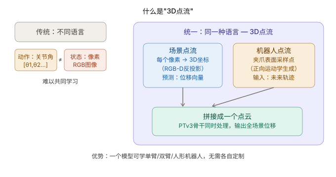

# 论文总结报告：《PointWorld: Scaling 3D World Models for In\-The\-Wild Robotic Manipulation》

# PointWorld: Scaling 3D World Models for In\-The\-Wild Robotic Manipulation


**论文信息：** arXiv:2601\.03782 \| CVPR 2026 \| Stanford \+ NVIDIA

链接：[point\-world\.github\.io/](https://point-world.github.io/)


---


## 一、论文定位（读前必看）


**核心定位**：由斯坦福大学和 NVIDIA 团队于 2026 年初提出的一种全新、**大规模预训练 3D 机器人世界模型** 。


PointWorld 解决的核心问题是：**在真实开放（in\-the\-wild）机器人操作场景下，如何从单张/少量 RGB\-D 观测和机器人动作，预测全场景 3D 几何如何随时间演化**。它把「状态」和「动作」统一表示为 **3D 点流（point flow）**——场景点来自 RGB\-D 反投影，机器人点来自 URDF \+ 正向运动学，二者在同一 3D 空间中共存，模型预测每个场景点在 3D 中的位移。


在世界模型谱系中，PointWorld 处于 **「大规模预训练、动作条件、3D 几何动力学」** 这一支：区别于视频生成世界模型（缺显式动作条件、物理一致性弱），也区别于传统关节空间动力学模型（ embodiment 绑定、难以跨机器人迁移）。它更接近 **「3D 物理模拟器的神经网络替代品」**，但输入是部分可观测的 RGB\-D，输出是 per\-point 3D 位移而非渲染图像。


**与团队目标「世界模型基座建立」的关联度：高**


理由：

- 直接给出 **可扩展的 3D 世界模型训练配方**（骨干网络、损失设计、数据混合、scaling law）

- 统一 state/action 表示，天然支持 **跨 embodiment 预训练**

- 0\.1s 推理延迟，可嵌入 MPC，具备 **基座 → 下游规划** 的完整链路

- 开源代码、数据集、预训练权重（NVlabs/PointWorld \+ HuggingFace）

    

**建议阅读优先级：精读**


---


## 二、核心运作原理



### 核心思路（工程类比）


可以把它理解成 **「3D 版的气象预报系统」**：


- **当前天气快照** = 从 RGB\-D 反投影得到的静态场景点云

- **人为扰动计划** = 机器人夹爪表面采样点在未来 H 步的 3D 轨迹（由 URDF \+ 关节角正向运动学生成）

- **预报任务** = 给定「快照 \+ 扰动计划」，预测每个场景点在未来 1 秒内会移动到哪里

    

关键设计：**状态和动作说同一种语言（3D 坐标 \+ 位移）**，就像把 SQL 查询和 SQL 结果放在同一张表里，跨机器人迁移时不需要重新设计 action space。


### 主要模块


|模块|职责|
|---|---|
|**场景点云构建**|RGB\-D 反投影 → 3D 点；用 FK 掩码去掉机器人像素|
|**机器人点流生成**|URDF 夹爪表面采样 300–500 点/夹爪，FK 传播到 H 步|
|**DINOv3 特征编码**|冻结 ViT\-L/16，将 3D 点投影到 2D 取 patch token|
|**PTv3 点云骨干**|拼接场景点 \+ 时间堆叠机器人点，U\-Net 式 attention|
|**MLP 预测头**|输出每个场景点在 H=10 步内的 3D 位移|
|**不确定性头**|预测 per\-point log\-variance，做 aleatoric 正则|
|**MPPI 规划器**|采样 SE\(3\) 末端轨迹 → 转 robot flow → 世界模型 rollout → 加权更新|


### 数据流


```Plain Text
输入:
  RGB-D 图像(1~3 相机) + 关节角序列 q_{t:t+H-1} + URDF
       ↓
  场景点: p_{0,i} ← backproject(RGB-D), mask robot
  机器人点: r_{t+k,j} ← FK(URDF, q_{t+k})
       ↓
  特征: 场景点 ← DINOv3; 机器人点 ← 时序 embedding + 几何特征
       ↓
  PTv3 骨干 → MLP 头
       ↓
输出:
  每个场景点 i 在 k=1..H 步的 3D 位移 → 未来 1 秒全场景点流
       ↓ (部署)
  MPPI: 采样 K 条 SE(3) 轨迹 → PointWorld rollout → 选最优动作
```


---


## 三、关键公式解析


### 公式：分块动力学映射（Chunked Dynamics）


**原文：**

$\mathcal{F}^{H}_{\theta}:(\mathbf{s}_{t},\,\mathbf{a}_{t:t+H-1})\rightarrow\mathbf{s}_{t+1:t+H}$


**符号对照表：**


|符号|含义|类型/维度|备注|
|---|---|---|---|
|$\mathcal{F}^{H}_{\theta}$|参数为 $\theta$ 的分块世界模型|神经网络|一次前向预测 H 步|
|$\mathbf{s}_{t}$|时刻 $t$ 的状态（静态场景点云）|点集，$N_S$ 个点|仅 $t=0$ 帧有观测|
|$\mathbf{a}_{t:t+H-1}$|动作序列（机器人点流）|H 步 × $N_R$ 点|来自 FK|
|$H$|预测步数|标量|论文取 H=10，每步 0\.1s|


**直觉解释：**


传统世界模型像「逐帧递归」：$s_{t+1} = f(s_t, a_t)$，每步都要跑一次网络，误差会累积\(Error Accumulation\)。PointWorld 像 **批量 SQL 更新**：一次传入当前状态和接下来 10 步动作计划，直接返回 10 步后的全部点位置，时间一致性更好、推理只需 1 次前向（\~0\.1s）。


> 传入：
> 
> - 当前世界状态 \(s\_t\)
> 
> - 接下来 H 步要执行的动作计划 \(a\_t,a*\{t\+1\},\.\.\.,a*\{t\+H\-1\}\)
> 
> 模型直接预测：
> 
> - 接下来 H 步世界会变成什么样
> \(s*\{t\+1\},s*\{t\+2\},\.\.\.,s\_\{t\+H\}\)
> P\.S\.s\_t 为当前状态故不用传出，从s*\{t\+1\}传出即可*
> 
> 


**代码实现：**

- 实现主体：pointworld/base\.py，DynamicsPredictor 类（文件中约第208–333行）

    - 文件路径： pointworld/base\.py

    - 核心方法：DynamicsPredictor\.forward

    - 动作：接收 scene\_coord0（s\_t）、scene\_feat0、robot\_coord\_seq（机器人轨迹，等价于动作序列 $a_{t:t+H-1}$）等，经过 predictor\_model 和 dynamics\_head，输出 pred（规范化后的位移预测）和 log\_var。最终返回的 out 包括 "pred"、"log\_var"，BaseModel 会将 pred 反归一化并构造 scene\_flows（$s_{t+1:t+H}$）。

    - 细节：dynamics\_head 只预测 T\-1 个未来步（首步用零填充），最终拼接成尺寸为 \(B, T, Ns, 3\) 的 dynamics（见文件中把 zeros\_first 与 dynamics\_partial 拼接的部分）。

- 输入构造与调用：pointworld/base\.py，BaseModel\.forward（文件中约第434–487行）

    - 作用：从 data\_dict 中取出 scene\_coord0 = data\_dict\["scene\_flows"\]\[:,0\]（对应 s\_t）和 robot\_coord\_seq = data\_dict\["robot\_flows"\]（对应动作序列 a\_\{t:t\+H\-1\}），并做归一化/特征投影后调用 self\.dynamics\_predictor\(\.\.\.\)。

    - T 的定义：在 BaseModel\.init 中 T = CONTEXT\_HORIZON \+ PRED\_HORIZON（文件中第342行附近），DynamicsPredictor 的预测长度与此 T 对应，模型内部把第一个时间步当作输入（用零填充预测序列的第 0 步）。

为什么这是 F^H\_theta

- 数学式 F^H\_theta:\(s\_t, a\_\{t:t\+H\-1\}\) \-\> s\_\{t\+1:t\+H\} 对应：

    - s\_t ↔ scene\_coord0（point positions at time t）

    - a\_\{t:t\+H\-1\} ↔ robot\_coord\_seq / robot\_flows（动作/机器人坐标随时间的序列）

    - 模型先把场景点和机器人点拼到一起，经过 predictor\_model（点变换器）和 dynamics\_head 输出未来点位移 pred，然后由 BaseModel 把 pred 反归一化并累加到 scene\_coord0 得到 scene\_flows（s\_\{t\+1:t\+H\}）。

- 具体代码段参考 pointworld/base\.py 中：

    - DynamicsPredictor\.forward 从 concat/构造 coord/feat/exists 到 point = self\.predictor\_model\(data\_dict\) 到 dynamics\_head 输出（约文件行 247–333）。

    - BaseModel\.forward 将 outputs\["pred"\] 反归一化并构造 out\["scene\_flows"\] = scene\_coord0\.unsqueeze\(1\) \+ pred（约文件行 483–488）。


**容易误解的地方：**

- 输入状态 $\mathbf{s}_t$ 是 **静态** 的（只有 $t=0$ 的 RGB\-D），不是递归地把上一步预测喂回去——chunk 内对应关系在模型内部维护

- 部署 MPC 时若规划 30 步，需要 **3 次** 自回归 chunk 调用（30/10=3），不是 30 次

    

---


### 公式：状态表示（Scene Point Flows）


**原文：**

$\mathbf{s}_{t}=\{\,(\mathbf{p}_{t,i},\,\mathbf{f}^{S}_{i})\,\}_{i=1}^{N_{S}}$


**符号对照表：**


|符号|含义|类型/维度|备注|
|---|---|---|---|
|$\mathbf{p}_{t,i}$|第 $i$ 个场景点的 3D 坐标|$\mathbb{R}^3$|从 RGB\-D 反投影|
|$\mathbf{f}^{S}_{i}$|第 $i$ 个点的特征|$\mathbb{R}^{D_S}$|含 RGB、法向、DINOv3 等|
|$N_S$|场景点数量|标量|体素下采样后 ≤12000|


**直觉解释：**


场景不是 mesh 或体素，而是 **带属性的点云**。每个像素对应一个 3D 点，特征在 $t=0$ 确定后不再变化（颜色/语义），只有位置随时间预测更新。类似游戏引擎里的 particle system，但粒子来自真实相机。


**公式解释：**


时刻 \(t\) 的场景状态 \($s_t$\) = 场景里所有点（point）集合，每个点由 **位置**$\mathbf{p}_{t,i}$和 **特征** ${f}^S_i $构成。${p}_{t,i}$意为时刻t时第 $i$ 个场景点的 3D 坐标。${f}^S_i $为点的静态附加特征：颜色、语义、法向量。$N_S$场景总共有多少个点，所以 i=1,\.\.\.,NSi=1,\.\.\.,N\_Si=1,\.\.\.,NS，每个点都有位置 \+ 特征。


${f}^S_i $：SceneEncoder2D\.forward 的作用：把一组三维点（每个点在现实世界里的 x,y,z）变成每点一个固定长度的“特征向量”（一串数字），这些特征可以代表这个点在图像里看起来的内容，后续网络用这些向量做判断或学习。

- 输出形状：每个样本有 B 个场景，每场景有 Ns 个点，每个点一个长度为 channels 的向量，写作 \(B, Ns, channels\)。

一步步用简单比喻解释代码在做什么 想象你有几张相机拍的照片（从不同角度拍同一个场景），还有每张照片的深度图（告诉你相机到场景每个像素的距离）。你也有场景里很多点的三维坐标，想知道“在这些图片里这些点长什么样子”，并把这些信息压成定长的一串数字（特征）。

1. 准备相机数据（把所有相机按固定顺序放在一起）

- 把每个相机的 RGB 图像、深度图、内参（intrinsic，控制从相机坐标到像素的变换）和外参（extrinsic，控制世界坐标到相机坐标的变换）组合成张量，统一成一个批次处理。

2. 用 DINOv3（预先训练好的视觉模型）把每张图像变成 patch token（可以想成把照片切成很多小方格，然后为每个小方格提取一个“方格特征”）

- 图像被划分为 16×16 的小块（patch），DINO 会为每个 patch 输出一个特征向量。

- 为了更好表达，每张图片从若干中间层取特征并把这些层的特征拼接起来，得到每个 patch 的“长向量”。

3. 把每个三维点投影到相机像素座标（把 3D 点“照射”到每张照片上得到像素位置）

- 用外参把世界坐标转到相机坐标，然后用内参把相机坐标换成像素坐标 \(x,y\)，同时得到投影深度 z。

- 代码为了数值稳定把这些点在浮点 32 位下计算（避免精度问题）。

4. 做“可见性”和“深度一致性”检查（判断这个点是不是真正出现在这张照片里）

- 边界检查：投影出的像素坐标是否在图片范围内（在图像里才可能“看见”）。

- 深度检查：把像素对应的深度图里的深度取出来（用双线性插值），比较投影深度和深度图上的深度：

    - 如果投影深度和深度图差别太大，就认为这个点被挡住或不可信（例如点在相机后面或被别的物体挡住）。

    - 这里允许一点误差（前后有不同的容忍度），误差阈值通过 args\.depth\_threshold 控制。

5. 在 ViT 的 patch 网格上取特征（把像素坐标映射到 patch 网格，然后用双线性插值取 patch 特征）

- 把像素坐标换算到“patch 的坐标系”（因为 patch 是若干个小方格，每个方格代表一块图像）。

- 用插值在 patch 特征图上取出每个点对应的特征向量（如果点不可见或越界，就用零代替）。

6. 把来自不同相机的特征聚合（如果多台相机都能看到同一个点，把它们的特征平均起来）

- 对每个点，把所有相机采样到的特征相加并除以“能看到这个点的相机数”，得到一个平均特征（这样更稳健）。

- 然后通过一个线性层（相当于一个矩阵乘法）把这个长特征压成需要的 channels 长度，得到最终的 scene\_features。

7. 把不存在的点（scene\_exists 为 False）设为 0

- 有些点在场景里其实不存在或被认为无效，代码把这些点的特征全部置为零，避免干扰后续计算。

重要参数和它们的作用（简单说明）

- channels：输出特征向量的长度（每个点最后得到多少个数字）。

- patch\_size = 16：图片被切成 16×16 像素的 patch（每个 patch 产生一个特征）。

- selected\_layers（\[4,11,17,23\]）：从 DINOv3 的这些中间层取特征并拼接，得到更丰富的表示。

- args\.depth\_threshold：深度容忍度，控制“投影深度”和相机深度图之间允许多少差别才算一致（数值越大越宽松）。

用一句话总结“这个特征包含什么？”

- 每个点的特征是“基于多视角图像中该点对应 patch 的视觉特征（由 DINOv3 提取）、经过可见性和深度一致性筛选、对多相机取平均并线性映射后的一个定长向量”，也就是说它是“点在图像里外观信息的压缩表示”。


**代码实现：**


关键位置（文件 \+ 作用说明）

- dataset\_components/transforms\.py

    - compute\_helper\_variables \(≈ lines 787–802\)

        - 处理/预计算 gt\_scene\_flows 的增量、移动/静止点掩码等（输入数据里的场景点位移即 gt\_scene\_flows，shape: \(T, NS, 3\)）。

    - enforce\_max\_num\_points \(≈ lines 750–771\)

        - 对 scene\_flows 做上限子采样（控制 NS 的数量）。

    - 用处：这里是数据管线层面把位置（p\_\{t,i\}）准备好并附带辅助标记。

- pointworld/base\.py

    - forward\(\.\.\.\)（≈ lines 435–447）

        - 解包 data\_dict：scene\_coord0 = data\_dict\["scene\_flows"\]\[:,0\]（位置），scene\_feat0 = data\_dict\["scene\_features"\]\[:,0\]（点特征），scene\_exists 等。

        - 用处：模型接收并使用 scene\_flows（位置序列）与 scene\_features（每点特征），直接对应公式中的 \(p\_\{t,i\}, f^S\_i\)。

    - encode\_scene\_features\(\.\.\.\)（≈ lines 420–431）

        - 调用 self\.scene\_feature\_encoder 来产生/编码场景特征。

    - init（≈ lines 310–360）

        - 在这里创建了 SceneFeatureEncoder（self\.scene\_feature\_encoder），即负责把点坐标/相机信息等变为 f^S\_i 的模块。

- scene\_featurizer\.py

    - SceneEncoder2D\.forward \(≈ lines 142–161\)

        - 一个具体的 scene feature encoder 实现（把三维点投影到相机视图并采样/生成每点的特征向量）。

        - 用处：实现 f^S\_i 的计算细节（如何从输入图像/深度得到每点特征）。

- pointworld/losses\.py

    - internal\_loss\_fn \(≈ lines 110–125\)

        - 使用 outputs\["scene\_flows"\] \(模型预测的 \(B,T,NS,3\)\) 与 data\_dict\["gt\_scene\_flows"\] 来计算损失。

        - 用处：验证和训练阶段把 p\_\{t,i\}（预测/GT）作为张量处理与评估。

- visualization（可选查看）

    - visualization/viser\_flow/upsampling\.py、visualization/prediction\_viz/visualizer\.py

        - 把 scene\_flows（位置序列）和对应颜色/存在掩码等组装成可视化时间线，用于展示场景点流（实现上也使用相同的数据结构）。

总结

- 公式中的 p\_\{t,i\} ↔ data\_dict\["scene\_flows"\]（张量形状示例： \(B, T, NS, 3\)）

- 公式中的 f^S\_i ↔ data\_dict\["scene\_features"\] / scene\_feature\_encoder 的输出（每点特征向量）

- 追踪路径：数据载入/预处理（dataset\_components/transforms\.py）→（可能）子采样（enforce\_max\_num\_points）→ 特征编码（scene\_feature\_encoder / scene\_featurizer\.py）→ 模型前向使用（pointworld/base\.py）→ 损失/可视化（pointworld/losses\.py / visualization/\*）。


**容易误解的地方：**

- 推理时 **不需要** CoTracker 等 2D tracker——tracker 只用于训练标注

- 不同 forward pass 之间点数量可以变化（体素下采样随机性）

    

---


### 公式：动作表示（Robot Point Flows）


**原文：**

给定关节序列 $\{\mathbf{q}_{t+k}\}_{k=0}^{H}$，在 $t$ 时刻对机器人表面采样一次，附着到 link 上，FK 传播得：

$\{\,(\mathbf{r}_{t+k,j},\,\mathbf{f}^{R}_{t+k,j})\,\}_{j=1}^{N_{R}}$


**符号对照表：**


|符号|含义|类型/维度|备注|
|---|---|---|---|
|$\mathbf{q}_{t+k}$|关节角配置|$\mathbb{R}^{n_{joints}}$|低层控制命令|
|$\mathbf{r}_{t+k,j}$|机器人表面点 $j$ 在 $t+k$ 的 3D 位置|$\mathbb{R}^3$|FK 计算|
|$\mathbf{f}^{R}_{t+k,j}$|机器人点特征|$\mathbb{R}^{D_R}$|含法向、速度、夹爪开合等|
|$N_R$|机器人点数|标量|每夹爪 300–500，总计 ≤500|


**直觉解释：**


动作不是 7 维关节角或 6DoF 位姿，而是 **「夹爪表面所有接触点的未来轨迹」**。这样 Franka 单臂和 G1 双臂人形说同一种「几何语言」，模型只需理解「这些 3D 点往哪动，场景怎么响应」。


**代码实现：**


- 核心实现在 robot\_sampler\.py 的 RobotSampler\.compute\_points（负责把预采样的网格点按链接的 FK 变换到每帧，返回每帧的点、法线、颜色），以及 RobotSampler\.fk（负责批量 FK，返回链接的 4x4 变换矩阵）。

- 上游调用在 dataset\_components/robot\.py 的 \_get\_robot\_flows\_behavior 和 \_get\_robot\_flows\_droid：它们把样本中的关节序列（sample\['joint\_positions'\] / gripper info）转换成 joint\_dict，调用 robot\_sampler\.compute\_points，随后（在 behavior 情况）用 base\_pose 把点从机器人/基座坐标系变换到 world 坐标系并处理 normals/colors。

- 用于可视化的轻量实现位于 visualization/viser\_flow/robot\_sampler\_lite\.py（compute\_world\_trajectories / presample），用于在可视化/overlay 中构建轨迹。

关键代码片段（来源与链接）

1. RobotSampler\.compute\_points — 采样点 \+ 调用 FK，返回 \(points, colors, normals\)

NVlabs / PointWorld / robot\_sampler\.pyv1

```Plain Text
# ...def compute_points(
    self,
    joint_values: Dict[str, torch.Tensor],
) -> Tuple[torch.Tensor, torch.Tensor, torch.Tensor]:
    """
```

2. RobotSampler\.fk — 批量前向运动学，返回每个 link 的 \(B,4,4\) 变换矩阵

NVlabs / PointWorld / robot\_sampler\.pyv2

```Plain Text
# ...def fk(
    self,
    joint_values: Dict[str, torch.Tensor],
    link_names: Optional[List[str]] = None,
) -> Dict[str, torch.Tensor]:
```

3. dataset\_components/robot\.py — 将样本关节序列转换并调用 compute\_points，然后（behavior）用 base\_pose 变换到 world frame

NVlabs / PointWorld / dataset\_components / robot\.pyv1

```Plain Text
# ...# Presample robot points with gripper filtering
robot_sampler.presample(max_robot_points, gripper_filter=gripper_filter, seed=seed)

# Convert joint positions to the format expected by GPU robot sampler
joint_tensor = torch.from_numpy(sample['joint_positions']).float()  # (T, 22)
```

4. dataset\_components/robot\.py — 在 behavior 路径中用 base\_pose 把点从 robot/base frame 变换到 world frame，并旋转法线、归一化颜色

NVlabs / PointWorld / dataset\_components / robot\.pyv2

```Plain Text
# ...
robot_flows = np.einsum('tij,tkj->tki', T_b, pts_h)[..., :3]
# Rotate normals with rotation part only, per-frame
R_b = T_b[:, :3, :3]  # (T,3,3)
robot_normals = np.einsum('tij,tkj->tki', R_b, robot_normals)
```

5. 可视化轻量路径（用于 overlay） — presample / compute\_world\_trajectories

NVlabs / PointWorld / visualization / viser\_flow / robot\_sampler\_lite\.py

```Plain Text
# ...def compute_world_trajectories(
    self,
    joint_positions: np.ndarray,  # (T, 7)
    gripper_positions: np.ndarray,  # (T,) or (T,1)) -> np.ndarray:
```

如何把你给的数学公式对应回代码

- 数学量 q\_\{t\+k\} 对应 sample\['joint\_positions'\]（或 joint\_dict 中各关节名字对应的张量）。在 droid（panda）场景还会同时有 gripper\_positions。

- “在 t 时刻对机器人表面采样，附着到 link 上” 对应 RobotSampler\.presample（或 URDFRealSampler\.presample）构建的 presampled mesh points 和 per\-mesh 点\-法线；这些点在 compute\_points 中按每个 link 的 FK 变换应用到每一帧。

- “FK 传播得 \{ \(r\_\{t\+k,j\}, f^R\_\{t\+k,j\}\) \}” 对应 compute\_points 返回的 robot\_flows（points r\_\{t\+k,j\}）、robot\_normals（法线 f^R\_\{t\+k,j\}）以及 robot\_colors（可认为是点的特征/颜色）。在 behavior 路径中，代码随后用 base\_pose 把点从 robot frame 变换到 world frame（见上面的变换片段）。


**容易误解的地方：**

- 机器人点是 **完全可观测** 的（已知 URDF），场景点是 **部分可观测** 的——这是刻意设计，解决遮挡下 contact 推理

- 只用夹爪点而非全身点：全身点在真实数据中会 **稀释** 稀疏的学习信号

    

---


### 公式：运动权重（Movement Weighting）


**原文：**

$m_{k,i}=\sigma\big(\kappa(\delta_{k,i}-\tau)\big), \quad w_{k,i}=\frac{m_{k,i}}{\sum_{k,i} m_{k,i}}$


其中 $\delta_{k,i} = \|\mathbf{P}_{t+k,i} - \mathbf{P}_{t,i}\|_2$（GT 位移范数）


**符号对照表：**


|符号|含义|类型/维度|备注|
|---|---|---|---|
|$m_{k,i}$|软运动似然|$[0,1]$|sigmoid 输出|
|$\sigma$|logistic sigmoid|函数||
|$\kappa$|温度参数|非负标量|控制 sigmoid 陡峭度|
|$\tau$|位移阈值|非负标量|低于此视为静止|
|$w_{k,i}$|归一化损失权重|概率分布|所有 \(k,i\) 之和为 1|


**直觉解释：**


全场景预测时，通常只有 1–5% 的点在动。直接用 L2 损失就像 **在 99% 静止帧上训练视频预测**——梯度被背景淹没。运动权重相当于给「正在动的点」发 VIP 票，让 loss 聚焦在真正有物理交互的区域。


**代码实现：**


代码里把公式分成三处实现——δ（位移范数）在 dataset\_components/transforms\.py 里计算，m（sigmoid 软权重）在 utils\.py 的 make\_soft\_selector\_labels 实现，最终归一化成 w（点权重）在 dataset\_components/collate\.py 中完成。

要点与对应位置

- δ\_\{k,i\}（GT 位移范数）：

    - 文件：dataset\_components/transforms\.py — 函数 compute\_helper\_variables\(\)

    - 代码：计算 gt\_scene\_flows\_delta = gt\_scene\_flows\[1:\] \- gt\_scene\_flows\[:\-1\]，然后 delta\_norm = np\.linalg\.norm\(gt\_scene\_flows\_delta, axis=\-1\)

    - 链接：https://github\.com/NVlabs/PointWorld/blob/05484826dfef74cbe278a3974179a5a16705d35d/dataset\_components/transforms\.py\#L780\-L844

    - 说明：注意代码使用的是每帧（相邻帧）位移 gt\_scene\_flows\_delta 的范数作为 delta\_norm；代码中也计算了从第一帧的相对位移 gt\_scene\_flows\_relative（若你期望 P\_\{t\+k,i\}\-P\_\{t,i\} 为多步位移，可关注这个差异）。

- m\_\{k,i\} = σ\(κ\(δ \- τ\)\)（sigmoid 软标签 / movement score）：

    - 文件：utils\.py — 函数 make\_soft\_selector\_labels\(\)

    - 代码：k = temp\_scale / max\(tau, 1e\-12\)；返回 torch\.sigmoid\(k \* \(delta\_norm \- tau\)\)（或 numpy 等价实现）

    - 链接：https://github\.com/NVlabs/PointWorld/blob/05484826dfef74cbe278a3974179a5a16705d35d/utils\.py\#L88\-L166

- w\_\{k,i\}（归一化点权重）：

    - 文件：dataset\_components/collate\.py — 在 collate 阶段构造 point\_weights

    - 代码：selector\_gt = collated\['scene\_selector\_gt'\]，然后 w = selector\_gt\.pow\(RELEASE\_WEIGHT\_GAMMA\)，对不可监督/不存在的位置置零，最后 weights\_norm = weights\.sum\(\)\.clamp\(min=1\.0\)；weights = weights / weights\_norm；保存为 collated\['point\_weights'\]

    - 链接：https://github\.com/NVlabs/PointWorld/blob/05484826dfef74cbe278a3974179a5a16705d35d/dataset\_components/collate\.py\#L212\-L276

- 常量（τ、temp\_scale、gamma）：

    - 文件：dataset\_components/constants\.py（DEFAULT\_SOFT\_SELECTOR\_TAU、DEFAULT\_SOFT\_SELECTOR\_TEMP\_SCALE、RELEASE\_WEIGHT\_GAMMA）

    - 链接：https://github\.com/NVlabs/PointWorld/blob/05484826dfef74cbe278a3974179a5a16705d35d/dataset\_components/constants\.py\#L20\-L90


**容易误解的地方：**

- 权重用 **GT 位移** 计算，推理时不需要——这是纯训练技巧

- 单独使用运动权重会 **放大噪声**；必须配合不确定性正则和 Huber loss

    

---


### 公式：训练目标（Eq\. 1，核心损失）


**原文：**

$\mathcal{L}=\tfrac{1}{2}\sum_{k,i}^{H,N_S} w_{k,i}\Big(\rho_{\delta}\big(\hat{\mathbf{P}}_{t+k,i}-\mathbf{P}_{t+k,i}\big)\,e^{-s_{k,i}}+s_{k,i}\Big)$


**符号对照表：**


|符号|含义|类型/维度|备注|
|---|---|---|---|
|$\hat{\mathbf{P}}_{t+k,i}$|预测 3D 位置|$\mathbb{R}^3$|模型输出|
|$\mathbf{P}_{t+k,i}$|GT 3D 位置|$\mathbb{R}^3$|标注 pipeline 生成|
|$\rho_{\delta}$|Huber loss|函数|$\delta=5.0$ mm|
|$s_{k,i}$|预测 log\-variance|标量|aleatoric uncertainty|
|$e^{-s_{k,i}}$|精度权重|正标量|不确定性越大权重越小|


**直觉解释：**


这是 **加权 Huber 损失 \+ 同方差不确定性正则** 的组合。Huber 对离群点鲁棒（真实数据标注噪声大）；$e^{-s}$ 项让模型对不确定的点「自动降权」；$+s$ 项防止模型把所有点的不确定性都预测为无穷大。三者配合解决「稀疏运动 \+ 噪声标注」的双重难题。


**代码实现：**

实现位置：pointworld/losses\.py 的 compute\_single\_output\_loss 函数。

要点说明（对应论文 Eq\.1）：

- rho\_delta\(\.\.\.\)：由 HuberLoss 实现，代码中为 huber = HuberLoss\(delta=args\.huber\_delta, reduction="none"\) error\_term = huber\(output\_norm, gt\_target\_norm\)

- s\_\{k,i\}（论文里的 log\-variance）：代码中为 log\_var，经 clamp 后为 log\_var\_clamped。

- e^\{\-s\_\{k,i\}\}：代码中通过 var = torch\.exp\(log\_var\_clamped\) 得到方差 var，然后用 error\_term / var（等价于 error \* e^\{\-s\}）。

- 1/2 因子：代码中以 per\_dim\_loss = 0\.5 \* \(error\_term / var \+ uncertainty\_logvar\_weight \* log\_var\_clamped\) 实现（uncertainty\_logvar\_weight 默认为 1\.0）。

- 权重 w\_\{k,i\}：来自数据字典 data\_dict\["point\_weights"\]，最后以 \(per\_point\_loss \* weights\)\.sum\(\) 应用并累加为总损失。

- log\_var 的上下界：VAR\_FLOOR / VAR\_CEILING（在 pointworld/base\.py 中定义），代码里用 math\.log\(var\_floor/ceiling\) 做 clamp，防止 NLL 发散。

- 调用处：internal\_loss\_fn（同一文件）负责准备 outputs、gt、weights、log\_var 等并调用 compute\_single\_output\_loss。

关键代码片段（文件与链接）：

- pointworld/losses\.py — compute\_single\_output\_loss: [https://github\.com/NVlabs/PointWorld/blob/main/pointworld/losses\.py](https://github.com/NVlabs/PointWorld/blob/main/pointworld/losses.py)

- 参数/常量定义在 pointworld/base\.py（例如 UNCERTAINTY\_LOGVAR\_WEIGHT、VAR\_FLOOR、VAR\_CEILING）: [https://github\.com/NVlabs/PointWorld/blob/main/pointworld/base\.py](https://github.com/NVlabs/PointWorld/blob/main/pointworld/base.py)


**容易误解的地方：**

- 仿真数据上 **不能** 直接学 uncertainty——残差趋零时 $s_{k,i}\to -\infty$，梯度爆炸；仿真域需固定 log\-variance 为常数

- 被 2D tracker 标记为 **不可见/遮挡** 的点不参与 loss（权重置零）

    

---


### 公式：任务代价（Task Cost for MPC）


**原文：**

$c_{\text{task}}(\mathbf{s}_{k})=\tfrac{1}{|\mathcal{I}_{\text{task}}|}\sum_{i\in\mathcal{I}_{\text{task}}}\|\mathbf{p}_{k,i}-\mathbf{g}_{i}\|_{2}^{2}$


**符号对照表：**


|符号|含义|类型/维度|备注|
|---|---|---|---|
|$\mathcal{I}_{\text{task}}$|任务相关点索引集|点集|GUI 或 VLM 指定|
|$\mathbf{p}_{k,i}$|预测第 $k$ 步点 $i$ 的位置|$\mathbb{R}^3$|世界模型输出|
|$\mathbf{g}_{i}$|点 $i$ 的目标位置|$\mathbb{R}^3$|用户指定|


**直觉解释：**


MPC 的 reward 直接在 **3D 点空间** 定义：「把你关心的那些点移到目标位置」。对刚性物体、可变形物体、铰接物体都适用——不需要分别设计不同的 cost function，只需选不同的点集。


**等价实现：**

关键位置与说明

1. pointworld/losses\.py — 在 evaluation/metrics \& loss 里计算了点到点的 L2（不是平方）并用 huber/NLL 风格的损失处理

- 这里计算了 l2 = torch\.norm\(output\_flows \- gt\_flows, dim=\-1\)（对应 \|\|p \- g\|\|）

- loss 逻辑使用 HuberLoss 并对每个维度做不确定性 re\-weighting（并不是直接平均的平方误差）

NVlabs / PointWorld / pointworld / losses\.py

```Plain Text
# 计算 per-point loss 的部分（片段）
    huber = HuberLoss(delta=args.huber_delta, reduction="none")
    error_term = huber(output_norm, gt_target_norm)  # (B,T,NS,3)
    per_point_loss = error_term.mean(dim=-1)  # (B,T,NS)# ...
```

2. pointworld/metrics\.py — 收集并汇总 L2 相关的指标（也是用的 norm，而不是显式平方和均值）

NVlabs / PointWorld / pointworld / metrics\.py

```Plain Text
@torch.no_grad()def collect_metrics(..., l2, ...):
    # 统计 l2 在不同掩码下的统计量
    _safe_stat(l2, moved_mask & pred_exists_supervised, "l2_moved")
    _safe_stat(l2, static_mask & pred_exists_supervised, "l2_static")
    _safe_stat(l2, pred_exists_supervised, "l2")
```

3. transform\_utils\.py — 若你需要简单的平移误差函数（Euclidean distance），仓库里有工具函数 translation\_error 和 get\_pose\_error（translation\_error 返回的是 L2 距离而非平方）

NVlabs / PointWorld / transform\_utils\.py

```Plain Text
def translation_error(t1, t2):
    """Compute Euclidean distance between two 3D points"""return np.linalg.norm(t1 - t2)

def get_pose_error(target_pose, current_pose):
    """返回 6-dim pose error，前三维为平移误差（target - current）"""
```


**容易误解的地方：**

- 需要人工（或 VLM）指定 **哪些点** 是任务相关的——这是当前主要局限

- 目标位置 $\mathbf{g}_i$ 是在 **3D 世界坐标** 下，不是图像像素坐标

    

---


### 公式：MPC 轨迹优化（Eq\. 2）


**原文：**

$\operatorname*{arg\,min}_{\mathbf{E}_{0:T}} \sum_{k=1}^{T}\Big[c_{\text{task}}(\mathbf{s}_{k})+c_{\text{ctrl}}(\mathbf{E}_{k})\Big]$

$\text{s.t.}\quad \mathbf{s}_{1:T}=\mathcal{F}^{T}_{\theta}(\mathbf{s}_{0},\mathbf{a}_{1:T}),\;\mathbf{E}_{0}=\mathbf{E}_{\text{measured}}$


**符号对照表：**


|符号|含义|类型/维度|备注|
|---|---|---|---|
|$\mathbf{E}_{k}$|末端执行器 SE\(3\) 位姿|$4\times4$ 或 7D|MPC 优化变量|
|$c_{\text{ctrl}}$|控制正则|标量|路径长度 \+ 可达性|
|$\mathbf{a}_{1:T}$|由 $\mathbf{E}_{1:T}$ 经 IK/FK 转成的 robot flow|点流序列||
|$T$|规划步数|标量|部署时 T=30（3 chunk）|


**直觉解释：**


在 SE\(3\) 空间采样末端轨迹 → 转成 robot point flow → 喂给 PointWorld 想象未来 → 算 cost → MPPI 加权更新。世界模型是 **可微或黑盒的 forward simulator**，MPC 是 **采样优化器**。


**容易误解的地方：**

- 优化变量是 **SE\(3\) 末端位姿**，不是关节角——IK 在内部完成

- 约束 $\mathbf{E}_0 = \mathbf{E}_{\text{measured}}$ 确保从当前真实位姿出发

    

---


### 公式：MPPI 权重更新


**原文：**

$\omega_{\ell}\propto\exp\!\left(-\frac{J^{(\ell)}}{\beta}\right)$


**符号对照表：**


|符号|含义|类型/维度|备注|
|---|---|---|---|
|$J^{(\ell)}$|第 $\ell$ 条采样轨迹的总 cost|标量|task \+ ctrl 之和|
|$\beta$|温度参数|非负标量|越小越 greedy|
|$\omega_{\ell}$|样本权重|概率分布|归一化后加权平均更新 nominal|


**直觉解释：**


标准 MPPI/Cross\-Entropy Method：cost 低的轨迹权重大，nominal 轨迹向低 cost 方向移动。PointWorld 的 0\.1s/chunk 推理速度使得 **并行评估 K 条轨迹** 在实时 MPC 中可行。


**等价实现：**


```Python
def mppi_update(costs, nominal_traj, sampled_trajs, beta=1.0):
    # costs: [K], sampled_trajs: [K, T, 7]
    weights = torch.softmax(-costs / beta, dim=0)  # [K]
    updated = (weights[:, None, None] * sampled_trajs).sum(dim=0)
    return updated
```


---


### 公式：3D 投影（DINOv3 特征提取）


**原文：**

$\tilde{u}_{c,i}=K_c(R_c x_{0,i}+t_c), \quad u_{c,i}=\bigl[\tilde{u}_{c,i}^{(1)}/\tilde{u}_{c,i}^{(3)},\,\tilde{u}_{c,i}^{(2)}/\tilde{u}_{c,i}^{(3)}\bigr]^{\top}$


**符号对照表：**


|符号|含义|类型/维度|备注|
|---|---|---|---|
|$x_{0,i}$|场景点 3D 坐标|$\mathbb{R}^3$|第一帧|
|$K_c$|相机内参|$3\times3$||
|$(R_c, t_c)$|相机外参|$3\times3$, $\mathbb{R}^3$|相对 robot base|
|$u_{c,i}$|投影像素坐标|$\mathbb{R}^2$|用于采样 DINOv3 token|


**直觉解释：**


3D 点 → 投影到 2D → 在 DINOv3 patch grid 上双线性插值取特征。多相机特征取平均。这是把 **2D 预训练视觉先验** 注入 3D 点云的标准做法。


**代码实现：**

- 对应代码（scene\_featurizer\.py，主要行号，基于当前 main 提交）：

    - 把世界坐标点扩成齐次坐标并从 \(B, Ns, 4\) 扩展到每视角 \(B, C, Ns, 4\)：lines 205–208

    - world \-\> cam：pts\_cam = world2cam @ pts\_h =\> 实现 R\_c x \+ t\_c（line 215）
    215: pts\_cam = torch\.matmul\(world2cam, pts\_h\_f\.transpose\(\-2, \-1\)\)\.transpose\(\-2, \-1\)\[\.\.\., :3\]

    - 相机内参乘以相机坐标得到像素齐次坐标 pix\_h = K\_c \* pts\_cam（line 216）
    216: pix\_h = torch\.matmul\(intr\_f, pts\_cam\.transpose\(\-2, \-1\)\)\.transpose\(\-2, \-1\)

    - 齐次归一化得到像素坐标 pixels（按你公式的除以第三分量）：lines 218–223
    218–223: 取 z = pix\_h\[\.\.\.,2\]; 做安全处理后 pixels = pix\_h\[\.\.\., :2\] / safe\_z

- 额外细节（实现里处理的实用逻辑）：

    - 使用 extrinsic / intrinsic 从 camera\_data 输入（变量名 extr 和 intr，见 lines 160–163）。

    - 做了 depth/可视性一致性检查（投影深度与深度图采样比较），并构造 visible mask（lines 229–260）。

    - 对无效 depth 做了安全除零保护并用 valid masks 排除（lines 218–226）。

    - 随后用 pixels 去从 DINOv3 patch\-token 网格上采样特征（lines 261–307）。

要查看原始代码请看该段在仓库中的实现（跳转到相关行）： [https://github\.com/NVlabs/PointWorld/blob/05484826dfef74cbe278a3974179a5a16705d35d/scene\_featurizer\.py\#L204\-L226](https://github.com/NVlabs/PointWorld/blob/05484826dfef74cbe278a3974179a5a16705d35d/scene_featurizer.py#L204-L226)

---


## 四、技术优势



1. **统一 3D 表示实现跨 embodiment 预训练**

    - 状态和动作都是 3D 点流，Franka 单臂 \+ G1 双臂可在同一模型上联合训练

    - 对世界模型基座：可直接复用 Open X\-Embodiment 等多机器人数据，无需 per\-robot action head

        

2. **Chunked 预测 = 实时 \+ 低漂移**

    - H=10 步一次前向，0\.1s 延迟，比 diffusion 视频模型（秒级）快 10–100×

    - 训练/推理 chunk 对齐，避免 autoregressive 误差累积

        

3. **大规模 scaling recipe 已验证**

    - PTv3 骨干可扩到 1B 参数，数据/模型 size 均呈 log\-linear 增益

    - 128×H100 训练 20 天 → 给出明确的 compute budget 参考

        

4. **运动权重 \+ 不确定性 \+ Huber 三件套稳定真实数据训练**

    - 解决「95% 点静止 \+ 标注噪声」这一 3D 世界模型的核心工程难题

    - 不确定性头还 emergent 地捕获物理属性（如布料边缘高方差）

        

5. **零样本部署到真实机器人**

    - 单个 checkpoint \+ MPC，无需 demonstration / finetune

    - 覆盖刚性推、可变形、铰接、工具使用四类任务

        

---


## 五、局限性与潜在缺陷


**论文自述：**

- 假设初始世界 **静态**（无初速度/动态物体）

- **\(❗️重要\) **MPC 需要 **手动指定** 任务点和目标位置

- 薄/小物体（笔、线）3D 标注困难

- 只预测几何位移，**不预测光度变化**（灯光、屏幕）

- 机器人假设 **刚体** URDF，忽略软体/腱驱动变形

- 动作是 **运动学** 路径，不建模控制器跟踪误差

- 无显式物理先验（牛顿力学等），纯数据驱动

- 学的是 **相关性** 而非因果（外生因素与机器人效果纠缠）

    

**\[推断\] 工程实践潜在问题：**

- 3D 标注 pipeline（FoundationStereo \+ VGGT \+ CoTracker3 \+ 优化）**极重**，复现数据质量是最大门槛

- 深度估计误差在 4m 以外/无纹理区域会系统性失败

- MPPI 对 cost 设计敏感，GUI 选点 \+ 目标位置在复杂任务上 **不可扩展**

- sim\-to\-real zero\-shot 失败，需 finetune（虽然 5% 步数即可）

- 1B 模型 \+ 128 GPU 训练成本对中小团队 **门槛极高**

    

**世界模型基座场景挑战：**

- 若基座目标是通用世界理解而非机器人操作，PointWorld 的 action\-conditioning 和 manipulation\-centric 数据 可能限制泛化到非操作场景

- 单帧 RGB\-D 输入不支持 temporal context（多帧历史），长 horizon 规划依赖 chunk 自回归

    

---


## 六、对团队的启发（最重要）


### 最值得复现/借鉴的技术点


**Top 1：3D 点流统一 state\-action 表示**


这是整篇论文最核心的设计决策。如果团队要做跨 embodiment 世界模型基座，应优先验证：

- 场景点 = RGB\-D 反投影 \+ 体素下采样（1\.5cm grid）

- 动作点 = URDF 夹爪采样 \+ FK（300–500 点/夹爪）

- 拼接后送 PTv3

    

**Top 2：运动权重 \+ aleatoric uncertainty 损失三件套**


真实 3D 数据几乎必然有标注噪声和稀疏运动。这三者组合是论文从 GBND baseline 到 SOTA 的关键之一，实现成本低、收益高。


**Top 3：Chunked prediction（H=10, 0\.1s/step）**


对任何需要实时 rollouts 的世界模型基座都适用——比 autoregressive 更准、更快。


### 影响基座架构选型的设计决策


|决策|PointWorld 选择|对团队的建议|
|---|---|---|
|状态空间|3D 点流（非 latent、非 pixel）|若目标含机器人操作，3D 点流优先；若目标含开放世界视频理解，需混合方案|
|动作空间|机器人 3D 点流（非 joint/EE pose）|跨 embodiment 必选；单机器人可 ablate|
|骨干|PTv3\-1B|50M 已可用，按 compute budget 选 132M/411M/1B|
|2D 先验|冻结 DINOv3|强烈建议保留；Sonata 等 3D 预训练尚不够|
|数据|DROID\(真\) \+ B1K\(仿真\) 混合|真\+仿 co\-training 优于单域；仿真 zero\-shot 不够但 finetune 高效|
|推理|Chunked \+ MPPI|基座提供 rollout API，下游接 planner/policy|


### 工程坑（论文未明说）


1. **相机外参精度是生命线**：DROID 原始 extrinsics 误差达数十 cm，必须用 robot\-depth reprojection 优化；否则 robot mask 不准 → 场景/机器人点混淆

2. **仿真数据的 uncertainty 处理**：联合训练时必须固定仿真域 log\-variance，否则梯度被仿真「干净数据」劫持

3. **体素下采样 1\.5cm 是精度/速度 sweet spot**：更细 → 点数爆炸 \+ PTv3 内存超限；更粗 → 丢失接触细节

4. **遮挡点的 paradox**：训练时遮挡点被 mask 掉，但模型对遮挡区域的预测反而 **比 GT 更准**（GT 来自有缺陷的 2D tracker）

5. **MPPI 部署细节**：30 步规划 = 3 次 chunk 自回归；每次 re\-plan 需重新构建 scene point cloud（静态假设）

6. **Finetune 只需 5% 步数** 但 domain gap 大时（sim→real）zero\-shot 完全失败——基座部署需预留 finetune pipeline

    

---


## 七、相关资源


### 关键前置工作

- **DROID** — 大规模真实场景机器人操作数据集

- **BEHAVIOR\-1K** — 家庭场景仿真 benchmark

- **FoundationStereo** — 零样本立体深度估计

- **VGGT** — 视觉几何 grounded transformer（相机位姿）

- **CoTracker3** — 2D 稠密点跟踪

- **Point Transformer V3 \(PTv3\)** — 点云骨干网络

- **DINOv3** — 2D 视觉预训练特征

- **MPPI** — 采样\-based MPC

- **Particle\-based dynamics \(Li et al\. 2018\)** — 粒子/点流动力学先驱

- **GBND \(Ai et al\. 2025 survey baseline\)** — 图神经网络动力学 baseline

    

### 值得对比阅读

- **Ctrl\-World / DreamGen / FLARE** — 视频/generative 世界模型 \+ 机器人

- **ParticleFormer / AdaptiGraph / FlowDreamer** — 3D 点/flow 动力学（非大规模预训练）

- **TD\-MPC2 / DayDreamer** — latent world model \+ MPC

- **Cosmos World Foundation Model** — NVIDIA 物理 AI 世界模型平台

- **Track2Act / Flow as Interface** — flow 作为 manipulation 接口

    

### 开源代码

- **官方代码：** [NVlabs/PointWorld](https://github.com/NVlabs/PointWorld)（Apache\-2\.0）

- **预训练权重：** [nvidia/PointWorld\_models](https://huggingface.co/nvidia/PointWorld_models)（HuggingFace）

- **项目主页：** [point\-world\.github\.io](https://point-world.github.io/)

- **论文：** [arXiv:2601\.03782](https://arxiv.org/abs/2601.03782)

    

---


**训练规模速查（PointWorld\-1B）：** 128×H100，20 天，batch=1920 sequences，300 epochs，\~2M trajectories / 500 hours，推理 \~0\.12s/chunk。


Copyright © 2026 [Austin-152](https://github.com/Austin-152)\. All rights reserved\.
